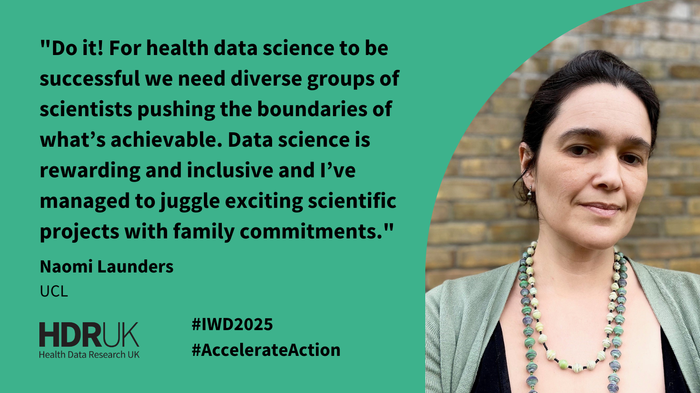
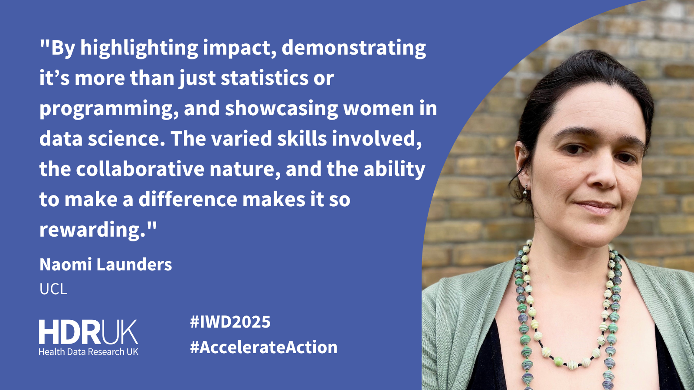

## International Women's Day 2025

This International Women's Day I talked to HDR UK about the importance of women in health data science.

For health data science to be successful we need diverse groups of scientists pushing the boundaries of what is achievable. Data science is rewarding and inclusive and I've managed to juggle exciting scientific projects with family commitments.

{fig-alt="A headshot and quote on why we should engage women in health data science"}

We need to engage more women in health data science by highlighting imapct, demonstrating it's more than just statistics or programming, and showcasing women in data science. The varied skills involved, the collaborative nature, and the ability to make a difference makes it so rewarding!

{fig-alt="A headshot and quote on how we can engage women in health data science"}